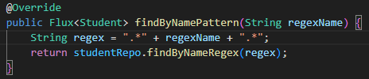
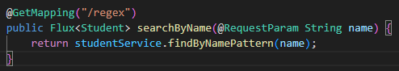
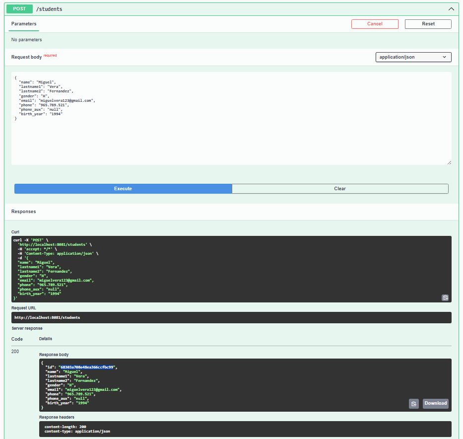
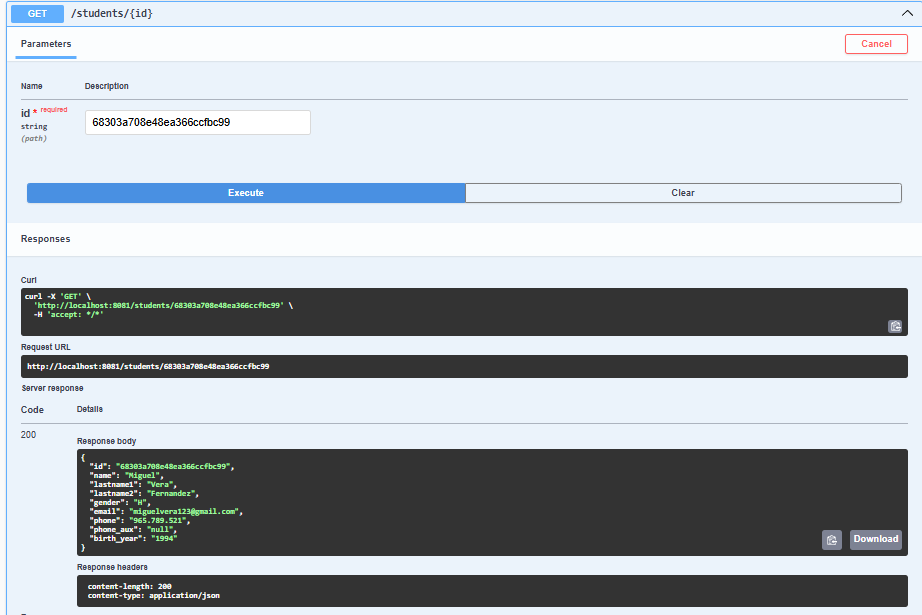
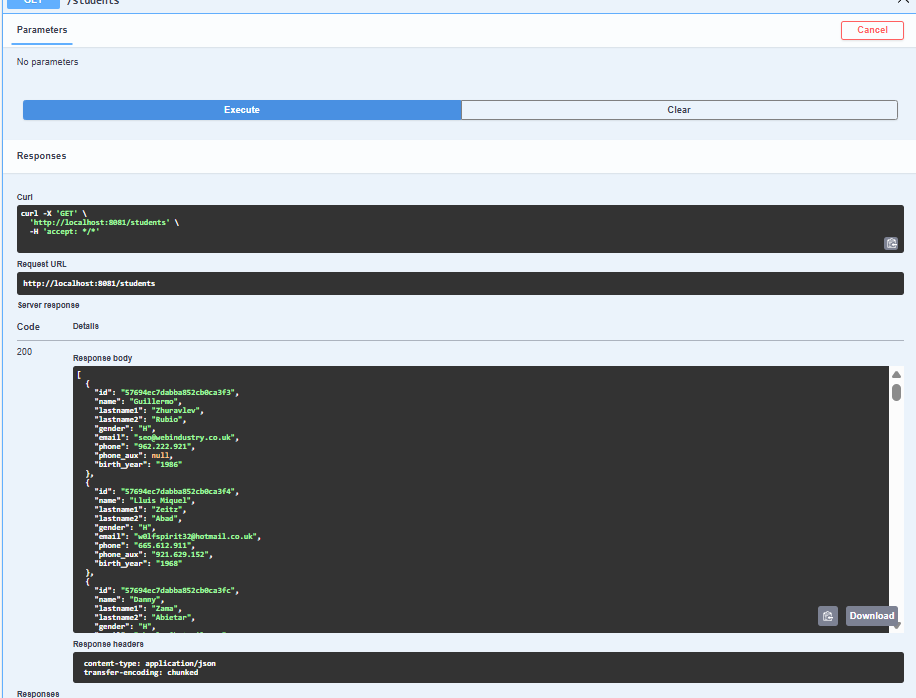
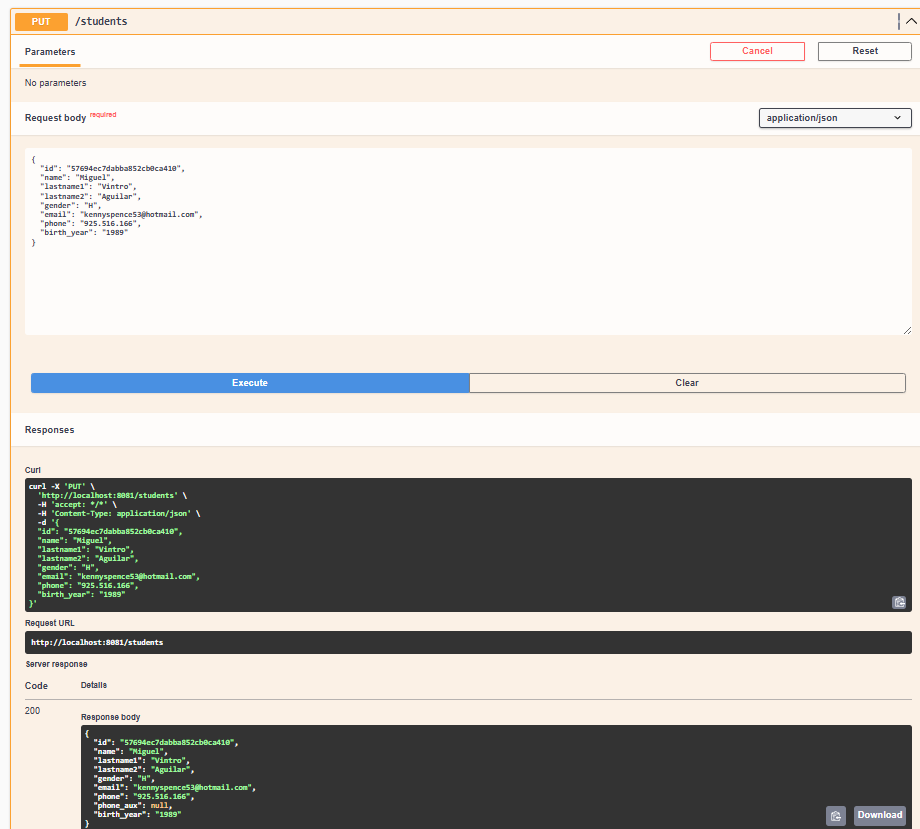
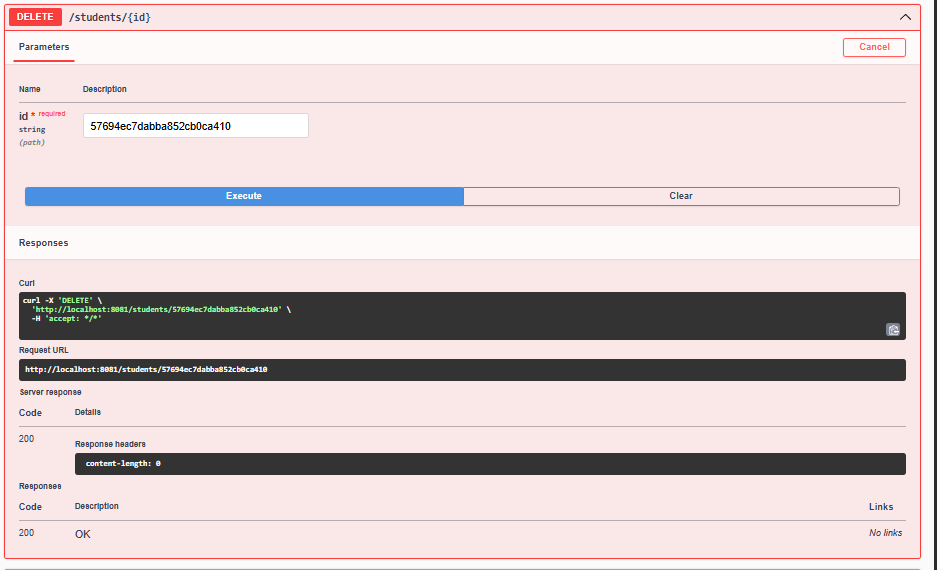

# AP_JD_MV_A02_UF3

## PREGUNTES PRÀCTICA


### Afegiu un endpoint que cerqui per un camp de tipus String on feu servir regex. Afegiu el que calgui al servei, repositori, etc.

Creamos un endpoint que busca por regex el nombre de alumnos en el campo 'name'





### Què caracteritza una api reactiva com aquesta i què la fa diferent d’una api síncrona amb MVC com les treballades anteriorment?

Una API reactiva, com la que es desenvolupa amb Spring WebFlux, es caracteritza principalment per seguir el model de programació no bloquejant i orientat a esdeveniments. Això vol dir que el servidor no queda esperant mentre una operació (com una consulta a base de dades) es completa, sinó que pot continuar gestionant altres peticions i torna al resultat quan aquest estigui llest. Aquesta manera de treballar permet una millor escalabilitat i rendiment, especialment en aplicacions que han de gestionar moltes peticions simultànies o processos lents com accés a bases de dades o serveis externs.

Per contra, una API basada en MVC (Model-View-Controller) com les fetes amb Spring MVC segueix un model síncron i bloquejant. Quan arriba una petició, el fil d'execució s'ocupa exclusivament d'aquesta fins que es resol. Això és més senzill de gestionar en aplicacions petites o amb poca càrrega, però no és tan eficient per sistemes que han de suportar gran concurrència o latències variables.

Per tant, la diferència principal és que l'API reactiva és no bloquejant i funciona per mitjà de fluxos de dades, mentre que l’API MVC és bloquejant i síncrona, gestionant una petició per fil.


### Què signifiquen Mono i Flux? Per a què penseu que serveixen i per què són útils en aquest tipus de programació?

Mono i Flux són els dos tipus principals que proporciona el projecte Reactor, base de Spring WebFlux, per treballar de manera reactiva.

Mono representa una font de dades que pot emetre zero o un sol element. S’utilitza, per exemple, per retornar un objecte únic (com quan es fa una cerca per ID o es fa una inserció a la base de dades).

Flux representa una font de dades que pot emetre de zero a molts elements, com un flux de dades, ideal per llistar tots els objectes d’una col·lecció o rebre dades contínuament.

Aquests tipus són útils perquè permeten treballar amb fluxos de dades d’una manera asíncrona, reactiva i sense bloquejos. A més, ofereixen una gran varietat d’operadors que faciliten la transformació i manipulació de les dades al llarg del seu recorregut. També gestionen automàticament errors i completen les operacions de manera eficient.

Són essencials en una API reactiva perquè encaixen perfectament amb la filosofia de gestió d’esdeveniments i permeten una millor utilització dels recursos, fent les aplicacions més eficients i escalables.


### Què és record? Un record utilitza getters i setters? Justifiqueu la resposta

Un record a Java és un tipus especial de classe que serveix per representar dades immutables de manera concisa. En lloc d’haver d’escriure tot el codi habitual (atributs, constructor, getters, equals, hashCode, toString), el record encapsula tot això automàticament.

Per exemple:

```java
public record StudentDTO(String id, String nom, int edat) {}
```
No utilitza setters perquè els valors dels atributs són immutables, és a dir, no es poden modificar després de crear l’objecte. Aquesta immutabilitat fa que els record siguin molt útils com a DTOs, ja que garanteixen que un cop creat, el contingut del DTO no es modificarà accidentalment. És ideal en entorns reactius i multi-fil, on la seguretat de dades i la previsibilitat del codi són fonamentals.

Per tant, un record no utilitza setters, només proporciona getters implícits, i això està justificat pel seu disseny orientat a la simplicitat, la claredat i la seguretat.

## CAPTURAS DE EJECUCIÓN

# SAVE



# GET BY ID



# GET ALL



# PUT



# DELETE BY ID

